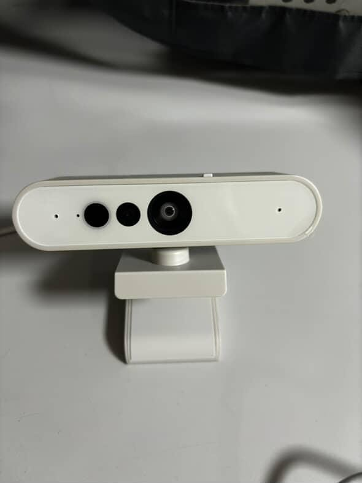
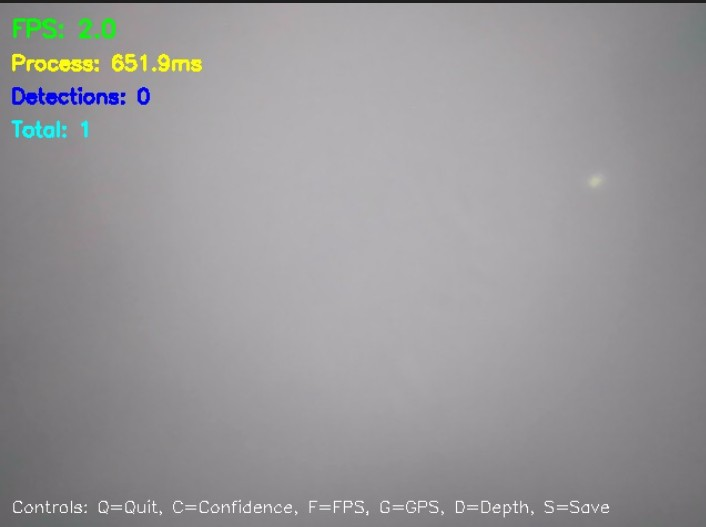
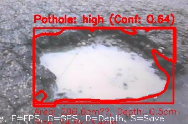
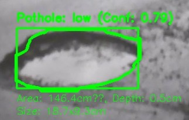
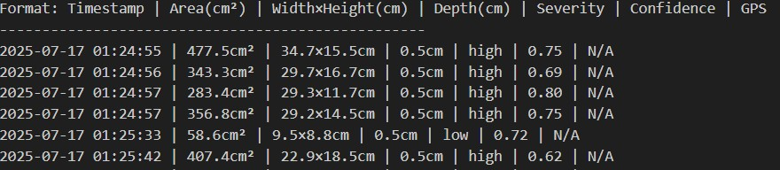

🛣️ Live Pothole Detection on Flexible Pavement

A **real-time, cost-effective pothole detection system** that works with low-end cameras and provides accurate pothole measurements using visual processing and lightweight AI logic. Designed to work on **flexible pavements**, this system outputs severity, depth, confidence, and area of potholes as they are detected live.

 🖼️ Preview

🎥 Camera Hardware

 🧠 Detection Interface

---

 🕳️ High Severity Pothole Detection

🕳️ Low Severity Pothole Detection

 📋 Pothole Detection Table Output

 🚀 Key Features

- ✅ Detects potholes in **real-time**
- ✅ Runs on **low-cost cameras**
- ✅ Provides **severity, area, width × height, and depth**
- ✅ Shows **confidence score**
- ✅ Live console data stream with pothole logs
- ✅ Works on flexible pavement and rough road textures

 ⚙️ Technologies Used

- Python (OpenCV, NumPy)
- Basic ML or CV logic for pothole contour detection
- Low-cost depth camera or webcam
- Command-line dashboard for structured output

 🧪 Output Format

Format: Timestamp | Area(cm²) | Width×Height(cm) | Depth(cm) | Severity | Confidence | GPS
2025-07-17 01:24:55 | 477.5cm² | 34.7×15.5cm | 0.5cm | high | 0.75 | N/A
.

> GPS is optional and marked `N/A` when not available.

 🏗️ System Components

* 📷 Camera Module (low-cost webcam or depth camera)
* 🧠 Detection Software (Python-based)
* 💻 CLI or lightweight GUI
* 📊 Console or file-based logs for detection results

 🔍 Use Cases

* Smart road monitoring systems
* College or university research prototypes
* Municipal road audits
* AI + Computer Vision integration projects
* Real-time embedded system testing

🧠 Future Enhancements

* [ ] GPS integration for geotagging detections
* [ ] Mobile version or Android-based live display
* [ ] Voice alerts for high-severity potholes
* [ ] Integration with GIS dashboard
* [ ] Improved detection using edge AI accelerators (like Coral or Jetson Nano)

 👤 Author

**Sanyam Sharma**
🧠 AI/ML & Vision Enthusiast
🎓 Research Intern – Structural Health Monitoring (2025)

 📃 License

This project is available under the [MIT License](LICENSE).

> 🚧 *Built for real roads. Made to scale.*

